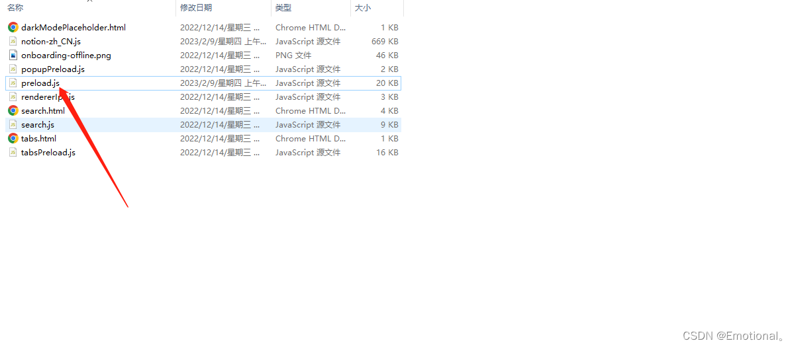

---
**更新时间：20230415，请酌情引用**
# Notion 笔记Mac及windows客户端汉化

## 1、 注册/登录账号：

https://www.notion.so/zh-cn


## 2、下载电脑软件应用：

https://www.notion.so/desktop

下载完成后，安装到电脑中，界面如下：


## 3、下载汉化js插件
地址：https://github.com/Reamd7/notion-zh_CN
点击更新的标签，下载【 notion-zh_CN.js 】文件


软件安装后，登录自己注册好的账号，如果没有账号，回到第一步进行注册：Notion提供了谷歌账号登录、Apple账号登录及邮箱地址登录，谷歌登录的小伙伴，我想想各位都有自己的方法，无法使用谷歌账号的小伙伴也不要灰心，可以使用Apple（苹果）账号进行登录，不会有网络的限制。

## 4、汉化

此步骤小伙伴们根据自己的需求进行操作就好
**windows版本**（自2.0.4版本后，任意语言都等价于中文了）
例如：Notion 安装目录：C:\Users\用户名\AppData\Local\Programs\Notion

1. 打开C:\Users\用户名\AppData\Local\Programs\Notion\resources\app\renderer文件夹
2. 把下载 notion-zh_CN.js 移动到上述（renderer）文件夹
3. 打开该文件夹下的 preload.js编辑, 复制下面的语句粘贴到你的文件中，放在最后一行即可，不要出现空格


```bash
//# sourceMappingURL=preload.js.map
require("./notion-zh_CN") 
```

完成上面的汉化步骤后，重启软件
require(“./notion-zh_CN”) 也可以使用 PowerShell 命令来完成。
命令执行完成后，在 Notion 中使用 CTRL+R打开黑窗口，进行热更新界面。
如果设置没生效，在应用端把语言设置为韩语，重启即可

```bash
Invoke-WebRequest -Uri "https://github.com/Reamd7/notion-zh_CN/releases/latest/download/notion-zh_CN.js" -OutFile "$HOME\AppData\Local\Programs\Notion\resources\app\renderer\notion-zh_CN.js"
Add-Content "$HOME\AppData\Local\Programs\Notion\resources\app\renderer\preload.js" 'require("./notion-zh_CN")'
```

## Mac电脑

网页端 以及 windows 端，能够100% 汉化，指的是时间显示也有国际化的能力，点击所有更新的时间轴中就能看出来，点击？悬浮按钮也能看到。

1. 打开Finder，应用程序，右键notion.app，显示应用包内容（自2.0.4版本后，任意语言都等价于中文了）
2. 打开 Notion.app\Contents\Resources\app\renderer
3. 把下载 notion-zh_CN.js 移动到上述（renderer）文件夹
4. 打开该文件夹下的 preload.js编辑, 复制下面的语句粘贴到你的文件中，放在最后一行即可，不要出现空格

```bash
//# sourceMappingURL=preload.js.map
require("./notion-zh_CN") 
```

完成上面的汉化步骤后，重启软件
只是 同样打开 Notion.app\Contents\Resources\app\renderer\ 即可。。（安装包显示有同样目录结构）
如果设置没生效，在应用端把语言设置为韩语，重启即可