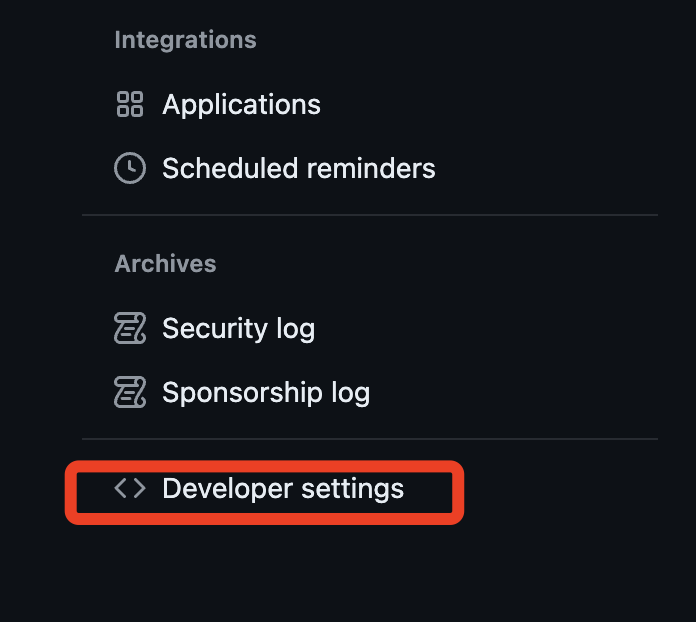
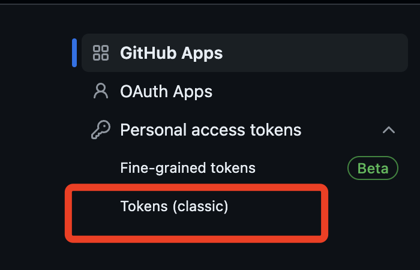
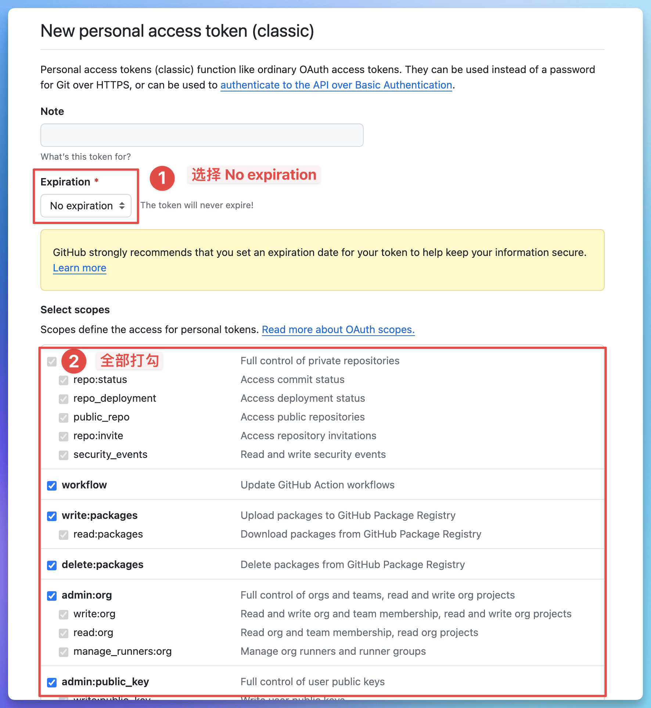
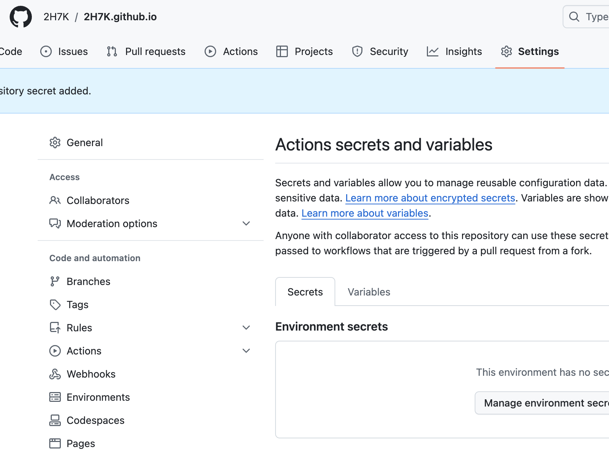
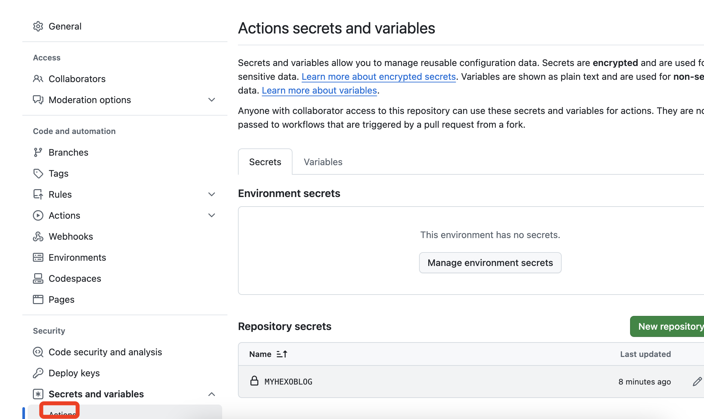
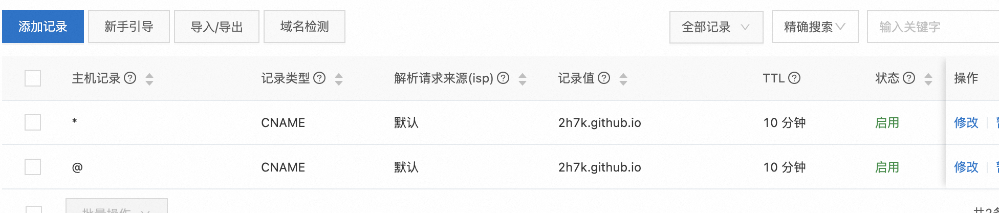
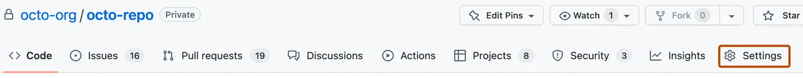
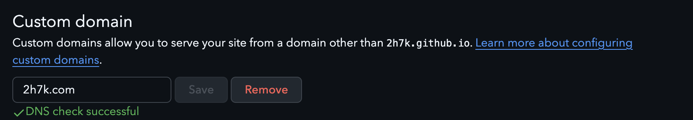

# 思路
1. 本地搭建hexo博客框架，用hexo生成静态网页。
2. 通过github的page功能发布静态网页。
3. github上建立2个分支，一个（主分支）存放hexo框架，一个（分支）存放hexo生成的静态网页。实现方法是设置git action工具，原理：git文化到主分支后，git action自动化运营hexo的部署命名，同时将生态的静态网页复制到分支上。

# 1.安装Node.js、git
1. 打开 Mac 自带的终端，在根目录下，通过Homebrew安装 Node.js、git、hexo
```
brew install node #安装Node.js、 git、hexo
brew install git  #安装git
```
# 2.初始化Hexo
- 本地新建`Hexo`文件夹，为本地仓库，终端中进入本地Hexo文件夹
```bash
cd /Users/apple/Documents/Hexo
```

- 安装Hexo脚手架
```bash
npm install -g hexo-cli #全局安装Hexo包（推荐菜鸟选择)
```

- 初始化Hexo
```bash
hexo init
```

- 安装Hexo依赖包
```bash
npm install
```
>初始化成功后，hexo文件夹内会出现如下的文件：
node_modules: 依赖包
public：存放生成的页面
scaffolds：生成文章的一些模板
source：用来存放你的文章
themes：放下下载的主题
_config.yml: 博客的核心配置文件（设置主体、标题等属性）

# 3.初始化仓库
- 方法一：可以选择利用VSCode等软件直接对项目开源到github仓库。(此次选择)
- 方法二：也可以手动去github创建一个空仓库，然后手动在命令行中推送。
```bash
#初始化
git init
#主分支更名（可选）
git branch -m main
#将本地仓库与远程仓库连接起来
git remote add origin https://github.com/2H7K/Hexo.git
#暂存所做的修改；这里的 `.` 表示 `--all` 即所有文件
git add --all
# 提交代码，其中引号内的内容可以自行更改作为提交记录
git commit -m ‘first git'
#推送本地仓库到远程仓库，其中main是本地仓库中主分支名称，一般更改后为 main
git push -u origin main
```
# 4.新建token
 在账号的个人`setting`中生成设置`token`
   




或者选repo和workflow

4. 生成的`token`设置到
并将它设置到项目仓库的 `secrets` 中，以方便我们在 `actions` 中调用，并保证敏感信息不暴露给其他用户：


**远程仓库的配置基本完成，回到本地仓库。**
# 5.修改_config.yml
在_config.yml中修改deploy字段。指示Hexo在deploy时的推送地址。
```bash
# Deployment
## Docs: https://hexo.io/docs/one-command-deployment
deploy:
  type: git
  repo: https://github.com/2H7K/Hexo.git
  branch: gh-pages
```
# 6.配置Github Action工作流
.github文件夹下新建文件夹`.github/workfolws/deploy.yml`
里面有个node-version要和你本地的node一致。
步骤大致意思就是使用ubuntu-latest作为基础环境，然后安装各种依赖，随后hexo generate生成博客网站静态文件夹， 把这个文件夹推送到同一仓库的gh-pages分支。
```bash
name: Deploy Hexo to GitHub Pages
on:
push:
branches:
- main # 当推送到 main 分支时触发
jobs:
build:
runs-on: ubuntu-latest
steps:
- name: Checkout repository
uses: actions/checkout@v2
with:
submodules: false # 禁用子模块检查
- name: Setup Node.js
uses: actions/setup-node@v2
with:
node-version: '22'
- name: Install Dependencies
run: npm install
- name: Install Hexo Git Deployer
run: |
npm install hexo-deployer-git --save
npm install hexo-cli -g
- name: Clean and Generate Static Files
run: |
hexo clean
hexo generate
- name: Configure Git
run: |
git config --global user.name 'github-actions[bot]'
git config --global user.email 'github-actions[bot]@users.noreply.github.com'
- name: Deploy to GitHub Pages
env:
GH_TOKEN: ${{ secrets.HEXO_TOKEN }}
run: |
cd public/
git init
git add -A
git commit -m "Create by workflows"
git remote add origin https://${{ secrets.HEXO_TOKEN }}@github.com/2H7K/Hexo.git
git push origin HEAD:gh-pages -f
```
# 7.推送验证
把刚才更新的所有文件都推送一遍，github就会触发工作流，然后去网站看工作流运转的如 何。
等一切运转完毕，就会发现仓库多出一个gh-pages分支。
# 8. 配置Github Pages
在仓库settings中配置page来源为gh-pages分支即可。等待网站部署完毕，就可以看了。
网站链接可以在settings的GitHub Pages看到，也可以去action里看到。
# 9 .修改Hexo主题样式
以一个比较热门的主题为演示示例，参考地址https://github.com/ppoffice/hexo-theme-
icarus。
若要使用NPM将Icarus安装为Node包，在你的Hexo站点根目录运行如下命令:
```bash
npm install -S hexo-theme-icarus hexo-renderer-inferno
```
接下来，使用hexo命令修改主题为Icarus:
```bash
hexo config theme icarus
```
会发现多出一个`_config.icarus.yml`文件。这是Icarus主题的配置文件。 最后推送到仓库，等待部署后，就可以了。
# 10.添加文章
你可以执行下列命令来创建一篇新文章或者新的页面。
```bash
hexo new [layout] <title>
```
您可以在命令中指定文章的布局(layout)，默认为 post，可以通过修改` _config.yml` 中的 default_layout 参数来指定默认布局。文章添加编辑后，现在只需要推送到仓库，那么github不仅会保存你的Hexo个人博客源 码，还会自动更新个人博客静态页面到gh-pages，由此触发github-page功能来更新你的个 人博客网站。
# 遇到了一些问题和方案
## 1. 网站没有样式问题
在网站打开F12，发现css等样式资源无法加载，仔细查看报错原因和请求地址，发现并不 是当前仓库。
缺少仓库地址，所以把请求地址复制一份，并在后面添加上仓库名即可，这需要修改 `_config.yml`中修改url字段。yourusername似乎为小写。
推送后等待工作流执行，查看结果。
```bash
# URL
## Set your site url here. For example, if you use GitHub Page, set url as 'https://username.github.io/project'
url: https://github.com/2H7K/Hexo
root: /
```

## 2.图片不显示
方法1：我们需要安装一个图片路径转换的插件，插件名字为**hexo-asset-image**，只需执行以下命令.（未解决）
```bash
npm install hexo-asset-img --save
```
在`_config.yml`中设置 `post_asset_folder: true`
意思是每个md博文会单独配套一个同名文件夹，用来存放图片。形如
source/_posts/
├── my-new-post.md
└── my-new-post/
    └── example.jpg

方法2：官方文档
资源（Asset）代表 `source` 文件夹中除了文章以外的所有文件，例如图片、CSS、JS 文件等。 比方说，如果你的Hexo项目中只有少量图片，那最简单的方法就是将它们放在 `source/images` 文件夹中。 然后通过类似于 `` 的方法访问它们。
obsidian中的设置

这样一来，部署的时候图片就不会不显示了，但是有个新的问题， 我在本地编辑md的时候无法预览图片怎么办。
建议用VSCode下载插件vscode-hexo和Hexo Utils，随后在左边栏目就可以看到新Hexo Utils的新菜单，只要你的VSCode当前打开的文件夹是hexo的根目录，那么插件就会自动 识别到，当你对md文件使用“侧边预览”时，图片就正常显示了。

## 3.设置了.gitignore文件不起作用，解决方法
如果按照正确设置了`.gitignore`文件，但仍然存在问题，可能是由于以下原因：
1. 文件已经被Git跟踪：如果在设置`.gitignore`之前，文件已经被Git跟踪并提交过一次，那么`.gitignore`对这个文件将不起作用。需要先使用以下命令将文件从Git仓库中移除：
```bash
git rm --cached <file>
```
然后再重新提交一次。
2. `.gitignore`文件位置不正确：请确保`.gitignore`文件位于Git项目的根目录下，并且文件名为`.gitignore`。
3. 文件路径错误：请确认`.gitignore`中指定的文件路径或模式是正确的。可以使用相对路径或绝对路径进行指定。
4. 缓存未清除：如果之前的缓存没有清除，`.gitignore`文件的更改可能不会立即生效。可以尝试清除Git缓存：
```bash
git rm -r --cached .
```
## 4.文章发布时间
## 5.绑定自己的域名
官方文档：
https://docs.github.com/en/pages/configuring-a-custom-domain-for-your-github-pages-site/managing-a-custom-domain-for-your-github-pages-site ：为 GitHub Pages 站点的自定义域名。
方法1：适用于建立github仓库时，名称使用`username.github.io` ，如未使用此命名方法，请参考方法2。
打开阿里云控制平台添加一条域名解析记录：
主机记录“@”，
记录类型“CNAME”，
记录值“username.github.io”，其他不用改，`username`为你的github账号名
回到上面创建的username.github.io ，点击“Setting”进入设置页面



在 GitHub Pages 的区域找到 Custom domain，在输入框里填入自己的域名，点击“save”，就完成了域名设置。现在输入自己的域名就能进入自己的博客页面了。



在Hexo文件夹内根目录，新建名为CNAME的文件，并输入你的域名`2h7k.com`

## 6. 配置中文
在旧的文档中，关于语言的配置，默认是英文的。如果我们想把网站中由主题、 配置的菜单、侧栏等选项卡的语言改成中文，就需要修改 **Hexo** 的 `_congif.yml`，注意，这里要修改的不是 主题的配置文件。
打开 `_congif.yml` 找到 `language`，这里就是第二个坑了，旧的文档中写道要配置简体中文则要将这一行改成 `language: zh-Hans`，然而当你这样配置之后，网站就会出现类似乱码，正确配置简体中文的代码应该是：
```
language: zh-CN
```