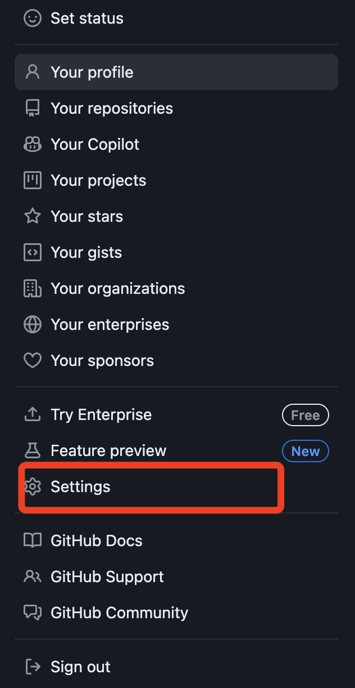

---
# 个人博客整体搭建思路
1. 本地搭建hexo博客框架；
2. 运行hexo命令生成静态网页后，git到github中（github中存储是的存储静态网页的public文件，而非hexo的源代码文件）
3. 用hexo生成静态网页
4. hexo可以git到github,之后直接部署在vercel上，就不需要本地hexo命令了，只需要安装一个git就ok了
5. 因为hexo有很多的文件夹，比如模块或者主题之类的，不管是写作还是同步，node都有大量的文件夹，改进方法是git上放两个分支，一个是主分支你的写作内容，另一个分支hexo分支，通过git action将需要发布的内容复制到hexo分支，然后使用分支即可
6. ob有git自动提交插件 这样一套流程下来，你就只需要专注于写作，提交的时候在ob中使用插件git一下就好了，本地是写作分支，也没有那么多的额外文件夹

# 记录
1. github官网： https://github.com/new
2. 本地仓库地址：/Users/apple/Documents/...
3. github远程仓库地址： https://github.com/2H7K/2H7K.github.io

# 一、安装依赖环境，部署本地的 Hexo 博客
1. 打开 Mac 自带的终端，在根目录下，通过Homebrew安装 Node.js、git、hexo
```bash
brew install node #安装Node.js、 git、hexo
brew install git  #安装git
npm install -g hexo-cli  #全局安装Hexo包（推荐菜鸟选择)
npm install hexo         #局部安装Hexo包(进阶) 全局和局部安装hexo可二选一
```

> [!NOTE] 可能的报错
> 产生的问题：npm: command not found
> 解决方法：参考 https://www.johnpapa.net/how-to-use-npm-global-without-sudo-on-osx/，
> 1. 强制删除旧 npm 文件夹中的所有内容，路径： /usr/local/lib/node_modules/，终端根目录下运行以下命令：
> `sudo rm -rf /usr/local/lib/node_modules`
> `sudo rm -rf ~/.npm`
>
> 2. 重新安装node后解决问题
> `brew uninstall node`

# 二、安装Hexo
1. 本地新建`Hexo`文件夹，为本地仓库
```bash
cd /Users/apple/Documents/Hexo #终端中进入本地Hexo文件夹
```
2. 初始化Hexo
```bash
hexo init #初始化Hexo
```
初始化成功后，`hexo文件`夹内会出现如下的文件：
`node_modules`: 依赖包
`public`：存放生成的页面
`scaffolds`：生成文章的一些模板
`source`：用来存放你的文章
`themes`：放下下载的主题
`_config.yml:` 博客的核心配置文件（设置主体、标题等属性）

```bash
cnpm install #此命令避免下面的hexo命令不合法
hexo g #生成静态网页，会生成`public`文件夹和相应的文件
hexo d #部署网页
hexo s #启动Hexo
```

3. 打开下面的网址，成功显示网址，表示本地安装成功


---

# 三、将Hexo 托管至 GitHub

1. 在github官网上新建线上远程仓库，获得远程仓库的地址： https://github.com/2H7K/2H7K.github.io ，设置仓库的名字以`XXX.github.io`结尾。


2. 本地Hexo仓库配置，
	- 在Hexo目录下，安装 hexo-deployer-git，`npm install hexo-deployer-git --save`
	- 卸载命令`rm -rf hexo-deployer-git` ，如有必要可卸载后重新安装
	- 配置`_config.yml`

```bash
# Hexo Configuration
## Docs: https://hexo.io/docs/configuration.html
## Source: https://github.com/hexojs/hexo/

# Site
title: 2H7K
subtitle: '众品'
description: '人即是人，物即是物，人物即时人物'
keywords: 可爱
author: LINK
language: zh-CN
timezone: ''

# URL
## Set your site url here. For example, if you use GitHub Page, set url as 'https://username.github.io/project'
url: http://example.com #https://github.com/2H7K/2H7K.github.io
permalink: :year/:month/:day/:title/
permalink_defaults:
pretty_urls:
  trailing_index: true # Set to false to remove trailing 'index.html' from permalinks
  trailing_html: true # Set to false to remove trailing '.html' from permalinks

# Directory
source_dir: source
public_dir: public
tag_dir: tags
archive_dir: archives
category_dir: categories
code_dir: downloads/code
i18n_dir: :lang
skip_render:

# Writing
new_post_name: :title.md # File name of new posts
default_layout: post
titlecase: false # Transform title into titlecase
external_link:
  enable: true # Open external links in new tab
  field: site # Apply to the whole site
  exclude: ''
filename_case: 0
render_drafts: false
post_asset_folder: false 
relative_link: false
future: true
syntax_highlighter: highlight.js
highlight:
  line_number: true
  auto_detect: false
  tab_replace: ''
  wrap: true
  hljs: false
prismjs:
  preprocess: true
  line_number: true
  tab_replace: ''

# Home page setting
# path: Root path for your blogs index page. (default = '')
# per_page: Posts displayed per page. (0 = disable pagination)
# order_by: Posts order. (Order by date descending by default)
index_generator:
  path: ''
  per_page: 10
  order_by: -date

# Category & Tag
default_category: uncategorized
category_map:
tag_map:

# Metadata elements
## https://developer.mozilla.org/en-US/docs/Web/HTML/Element/meta
meta_generator: true

# Date / Time format
## Hexo uses Moment.js to parse and display date
## You can customize the date format as defined in
## http://momentjs.com/docs/#/displaying/format/
date_format: YYYY-MM-DD
time_format: HH:mm:ss
## updated_option supports 'mtime', 'date', 'empty'
updated_option: 'mtime'

# Pagination
## Set per_page to 0 to disable pagination
per_page: 10
pagination_dir: page

# Include / Exclude file(s)
## include:/exclude: options only apply to the 'source/' folder
include:
exclude:
ignore:

# Extensions
## Plugins: https://hexo.io/plugins/
## Themes: https://hexo.io/themes/
theme: maupassant ##landscape

# Deployment
## Docs: https://hexo.io/docs/one-command-deployment
deploy:
  type: git
  repo: https://github.com/2H7K/2H7K.github.io.git
  branch: public-pages #分支作为静态网页部署
```


3. 初始化Hexo仓库
```bash
#初始化
git init

#主分支更名（可选）
git branch -m main

#将本地仓库与远程仓库连接起来
git remote add origin https://github.com/2H7K/2H7K.github.io.git

#暂存所做的修改；这里的 `.` 表示 `--all` 即所有文件
git add --all

# 提交代码，其中引号内的内容可以自行更改作为提交记录
git commit -m ‘first git'

#推送本地仓库到远程仓库，其中main是本地仓库中主分支名称，一般更改后为 main
git push -u origin main
```

>这里需要输入github的用户名和密码（是指生成token)

一个本地的前端项目就创建好了，我们可以通过 `git` 在本地管理代码。
 至此，我们就将本地和远程的仓库进行了连接，可以方便地通过 `git pull` 和 `git push` 拉取和推送代码了。


# 四、使用 Github Pages 构建和部署静态页面
1. 在远程仓库中`pages`中设置主分支`main`如下：
**这个分支主要存放`Hexo`的源文件**

2. 在项目的远程仓库中，创建一个新的分支 `public-pages` （也可以是其他名字）：
**这个分支的作用是承载编译后的静态页面文件，因此，该分支不需要同步到本地仓库。**


3. `pages`中设置分支`public-pages`


4. 在账号的个人`setting`中生成设置`token`
   


建议只勾选：repo和workflow

5. 打开 https://2h7k.github.io/ 查看网站，说明构建完成后， Github Pages 已将静态文件部署到页面服务器


# 五、安装Hexo主题
1. Hexo主题页： https://hexo.io/themes/
2. 安装主题：[maupassant-hexo](https://github.com/tufu9441/maupassant-hexo)
3. 主题中文文档： https://www.haomwei.com/technology/maupassant-hexo.html
``` bash
安装主题和渲染器
git clone https://github.com/tufu9441/maupassant-hexo.git themes/maupassant
npm install hexo-renderer-pug --save
npm install hexo-renderer-sass-next --save
说明：如果安装失败可能是网络太差了
```

# 六、vercel自动部署
原理：识别github中`main`分支有文件提交后，自动执行hexo的部署命令生成`public`静态网页文件，并部署到github的`public-pages`分支。hexo的部署命令:`hexo g`、`hexo d`、 `hexo s`。

1. 访问[Vercel官网](https://vercel.com/)，点击右上角的sign up进行注册
    
    用github账号登录
    

2. 注册完成后选择新建一个项目 或者会识别你github中的项目，选择导入
    

3. 导入静态页面仓库之前，需要为你的Github安装Vercel，此处建议选择All repositories，意为为所有仓库安装，你可选择，也就是Only select repositories（只为当前仓库安装）。

    

4. 之后会识别出你的静态页面，单击Continue
    


    

5. 到此时，Vercel的部署其实就已经完成了，可以使用Vercel提供的默认域名来访问静态页面，比Github的原网站要快许多。
6. 自定义域名配置
    想必到了这步一定不会甘心于默认域名，所以可以在`project->settings->domains`里配置自定义域名，填入自定义域名以后还要根据Vercel提供的解析记录去自己的域名DNS解析处添加相应解析。

    
    4这里添加域你的域名
7. 查看vercel提供的记录值地址，这个有你注册的域名解析中用得到，在你的域名注册商那里解析域名
	

    

8. 至此，`Vercel`的配置就完成了。`username.github.io`的解析记录了。

