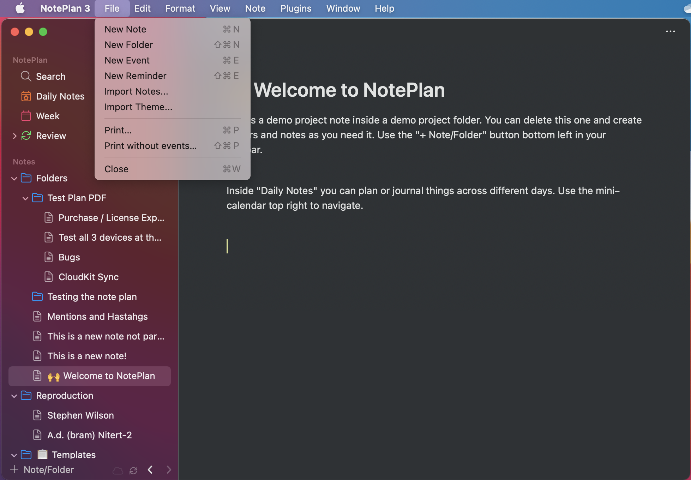
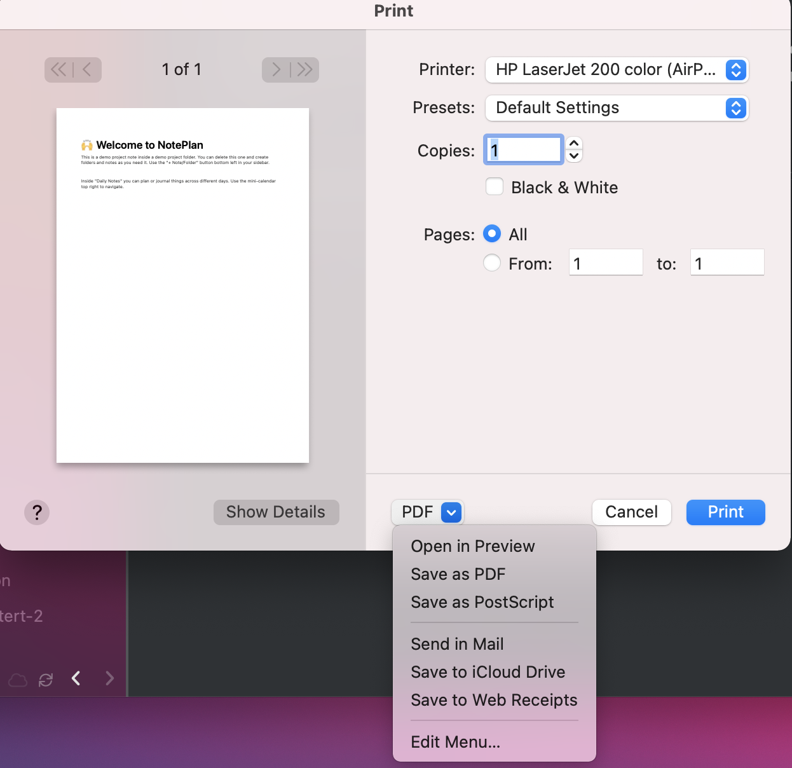
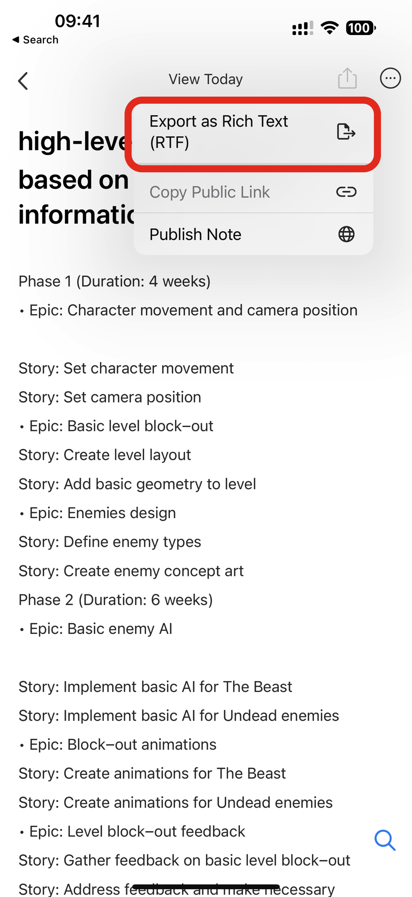
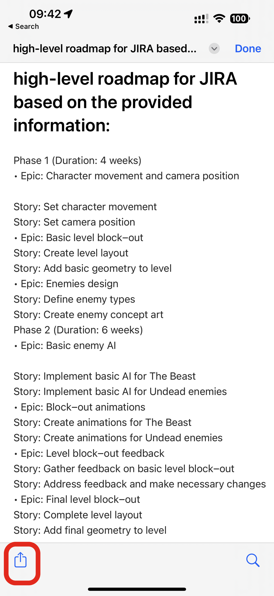
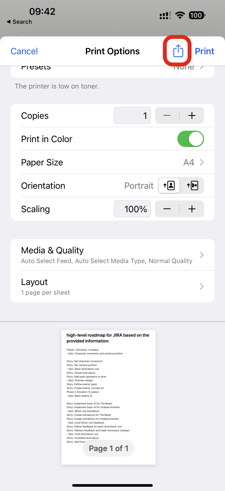

#NotePlan
您可以使用 macOS、iOS 或 iPadOS 内置打印功能以 PDF 格式打印所有笔记。只需按照以下步骤创建笔记的 PDF 导出即可。
 MacOS操作系统：
打开要打印的笔记，然后转到“文件”>“打印...

打印框打开后，单击“打印”对话框左下角的“PDF”按钮，然后选择“另存为 PDF”

 iOS 和 iPadOS：
打开要打印的注释，然后选择“导出为富文本 （RTF）”

点击“共享”按钮，然后选择“打印”：

再次点击打印窗口上的“共享”按钮，然后选择“保存到文件” - PDF 副本将保存到您的文件中：

